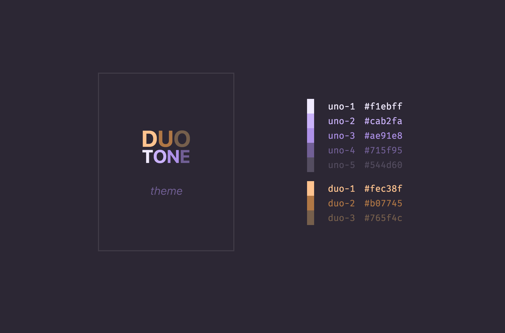
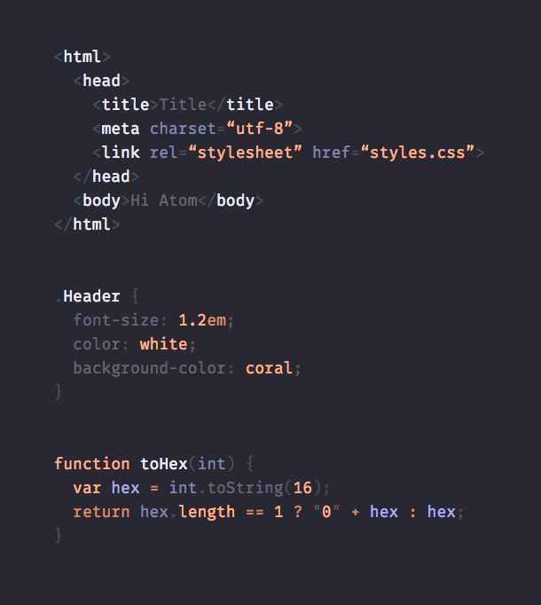

> Note: This theme isn't published. It serves as the master "template" for all DuoTone themes.

# DuoTone Syntax (master)

A double-hue syntax theme for Atom.



DuoTone themes use only 2 hues (8 shades in total). It __tones down__ less important parts (like punctuation and brackets) and highlights only the __important__ ones. This leads to a more calm color scheme, but still lets you find the stuff you're looking for.



## Language support

DuoTone themes are optimized for many languages:

> C, Clojure, CoffeeScript, C#, CSS, GF Markdown, Go, Haskell, HTML, Java, JavaScript, JSON, Less, Perl, PHP, Python, Ruby, SASS, SCSS, Stylus, XML, YAML...

See the list of [all languages](/styles/languages).


## Variations

Here a list of all [DuoTone themes](https://atom.io/themes/search?utf8=%E2%9C%93&q=keyword:duotone). Or at least the ones that have the `duotone` keyword added. :grin:


## Create your own DuoTone theme

Follow the short guide how to create your own DuoTone version.

1. Clone this repo.
2. Rename it (folder, package.json, etc).
3. Change the colors in `styles/colors.less`.
4. Publish!

Optionally, also

1. Run `docs/update.sh` to update the `docs/index.html` page.
2. Then replace the screenshots (`docs/screenshot.png` and `docs/screenshot-code.png`) with your version.

For more help, feel free to open a new issue.

#### Keep your DuoTone theme up to date

You can always watch this repo to get notified about changes and manually apply or cherry pick them into your theme too.

Or you can add this theme as a dependency to your `package.json` file:

```json
"dependencies": {
  "duotone-syntax": ">=2.0.0 <3.0.0"
}
```

and then import all the language styles in `index.less`:

```less
// This imports the language styles from the duotone-syntax npm package
// If you test locally, make sure to first run `apm install`
@import 'node_modules/duotone-syntax/styles/languages/_index';
```
